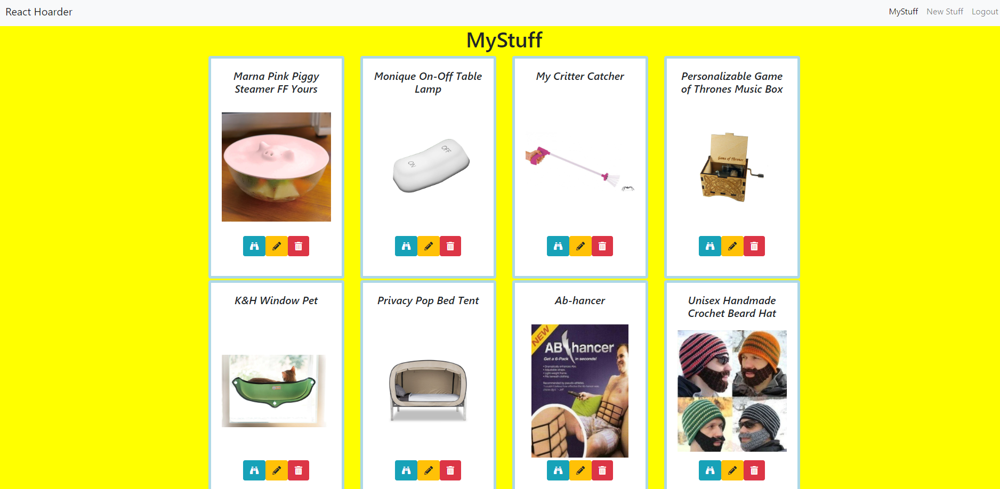
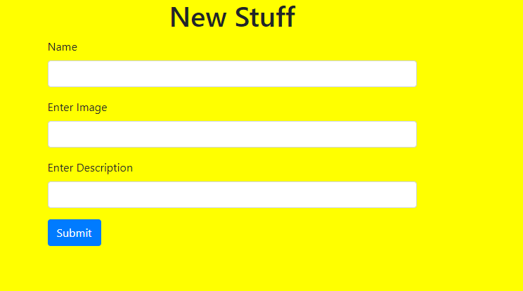

# React-Hoarder

## Description
This showcases the use of React and all CRUD features using firebase.

### Feature List
- Google Login Button with Firebase
- Firebase json data
- MyStuff
- NewStuff
- EditStuff

## Screenshots

### MyStuff View

### NewStuff View

### SingleStuff View

## How to Run
1. Clone down this repo
1. Make sure you have http-server installed via npm. If not get it [HERE](https://www.npmjs.com/package/http-server).
1. Use the apiKeys.example.json to enter your API key information from firebase
1. On your command line run `hs -p 9999`
1. In your browser go to `http://localhost:9999`

## Contributors

[Monique Bass](https://github.com/Nikababy01)